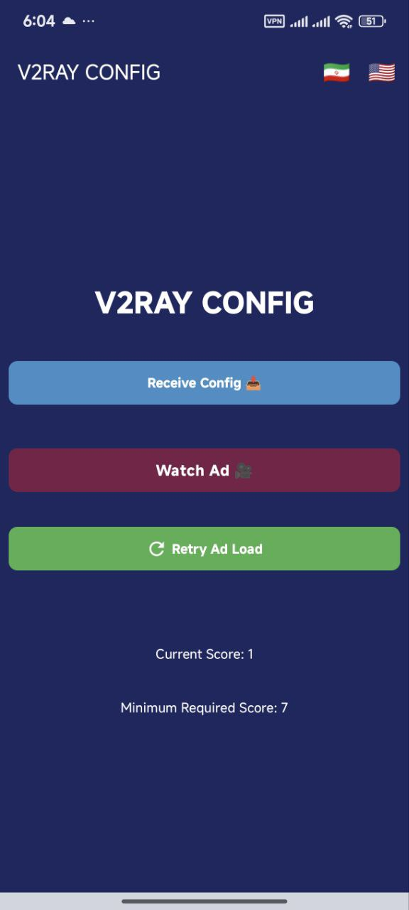

# Free V2Ray

Free V2Ray is an open-source Android application that allows users to receive configuration data after watching rewarded ads. It is designed to be lightweight, privacy-conscious, and censorship-resistant.

---

## Features

- Language selection at first launch (English & Persian)
- Config access gated by rewarded ads
- In-app notification system for server messages
- Rate-the-app prompt after 3 app launches
- Simple and user-friendly interface

---

## Screenshots


- 
- 

---

## How to Build

1. Clone the repository:
   ```bash
   git clone https://github.com/kiowgarden/free-v2ray.git
   cd free-v2ray
   ```

2. Build the debug APK:
   ```bash
   ./gradlew assembleDebug
   ```

GitHub Actions is already configured for automated builds.

---

## License

This project is released under the MIT License.

---

# فری وی‌تو‌ری

فری وی‌تو‌ری یک اپلیکیشن اندروید متن‌باز است که به کاربران اجازه می‌دهد پس از تماشای تبلیغات پاداشی، کانفیگ دریافت کنند. این اپلیکیشن سبک، ایمن، و مقاوم در برابر فیلترینگ طراحی شده است.

---

## ویژگی‌ها

- انتخاب زبان (فارسی و انگلیسی) در اولین اجرا
- دریافت کانفیگ با تماشای تبلیغ پاداشی
- سیستم اعلان داخلی برای پیام‌های سرور
- درخواست امتیاز به برنامه پس از ۳ بار اجرا
- رابط کاربری ساده و روان

---

## تصاویر برنامه


- 
- 

---

## نحوه ساخت

1. کلون کردن مخزن:
   ```bash
   git clone https://github.com/kiowgarden/free-v2ray.git
   cd free-v2ray
   ```

2. ساخت فایل APK حالت دیباگ:
   ```bash
   ./gradlew assembleDebug
   ```

اکشن‌های گیت‌هاب برای ساخت خودکار تنظیم شده‌اند.

---

## مجوز

این پروژه تحت مجوز MIT منتشر شده است.
